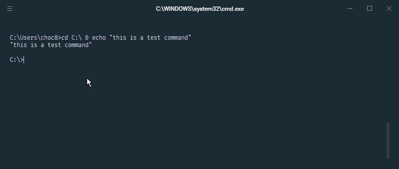
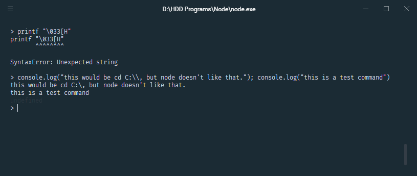

<p align="center"></p>

<h1 align="center">hyper-init</h1>

<p align="center">The ultimate and most complete extension to initialize commands before and after <a href="https://hyper.is/">Hyper terminal</a> starts
<br/><br/>
<a href="https://www.patreon.com/daltonmenezes"></a>
<a href="https://paypal.me/daltonmenezes"></a>
    <a href="https://www.npmjs.com/package/hyper-init"></a>
    
    <a href="https://github.com/bnb/awesome-hyper"></a>
<a href="https://github.com/daltonmenezes/hyper-init/blob/master/LICENSE">
    
</a>
</p>

> With **hyper-init** you can perform as many commands as you would like to do, before and after Hyper terminal starts, using rules that define when your commands should run.

<p align="center"></p>

## Table of Contents

- [Table of Contents](#table-of-contents)
- [Installation](#installation)
- [Configuration](#configuration)
  - [init](#init)
    - [Rules](#rules)
    - [Commands](#commands)
  - [clearCommand](#clearcommand)
  - [commandSeparator](#commandseparator)
- [License](#license)


## Installation

If you don't have Hyper, install it [here](https://hyper.is/#installation).

So, type the following on Hyper:

```
hyper i hyper-init
```

## Configuration

### init

`hyper-init` can be configured within the `config` object in the `~/.hyper.js` configuration file.

All you have to do to get started is to create an array of objects called `init`, like this:

```js
init: [
  {
    rule: 'once',
    commands: ['cd ~/Desktop', 'ls']
  }
]
```

Your `~/.hyper.js` configuration file should look like this:
```js
module.exports = {
  config: {

    // add hyper-init configuration like this:
    init: [
      {
        rule: 'once',
        commands: ['cd ~/Desktop', 'ls']
      },
      {
        rule: 'windows',
        commands: ['echo This is only executed on New Windows!']
      }
    ]
  },

  plugins: ['hyper-init']

}
```

#### Rules
A string that defines when you want your commands to run.

 Rule | Description
 --- | ---
 `once` | executes your commands only at Hyper starts
 `windows` | executes your commands only when a new Hyper window opens
 `tabs` | executes your commands only when a new tab is opened
 `splitted` | executes your commands only when a new pane is opened
 `all` | executes your commands every time a terminal opens

#### Commands
An array with your shell commands to run.<br/>
You can perform as many commands as you would like.

Example:
```js
commands: ['cd ~/Desktop', 'ls']
```


### clearCommand

`hyper-init` clears the terminal buffer using `printf "\\033[H"` as the default value, but you can set it manually adding the `clearCommand: ''` property within the `config` object. For example:

```js
module.exports = {
  config: {
    clearCommand: 'reset'
  }
}
```

### commandSeparator

`hyper-init` uses ` && ` as the default separator for commands.
For known terminals, `hyper-init` can infer the separator.
You can also set it manually by adding the `commandSeparator: ''` property within the `config` object,
but this overrides for all terminals, even ones that don't support that delimiter.
For example:

```js
module.exports = {
  config: {
    commandSeparator: ' ++ ' // For an arbitrary terminal that uses `++`
  }
}
```





No, I haven't fixed the `printf \033[H` error yet. I will. Soon

## License
[MIT License](https://github.com/daltonmenezes/hyper-init/blob/master/LICENSE)
